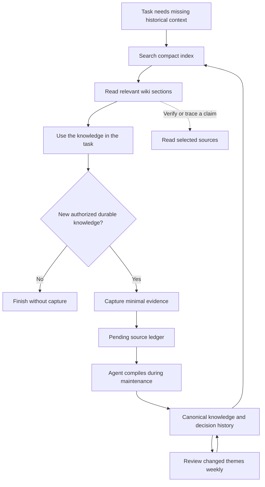

# Knowledge lifecycle

The wiki helps an agent reuse reasoning that is expensive to reconstruct and absent from current code or project documentation.
Examples include why an approach was rejected, which constraint shaped a project, and what a prior attempt taught us.
It is not a transcript archive or an automatically refreshed mirror of every repository.

## Entry and retrieval

Each participating agent receives a short global routing rule and, where supported, a small runtime skill.
The rule does not require a wiki read on every task.
It directs the agent to recall only when the current context cannot answer a question about historical intent, decisions, constraints or lessons.

The tool searches `_system/catalog.jsonl` locally and returns a bounded list of matches.
The agent reads relevant sections from `wiki/`, widening the search or opening a source only when needed.
The index is a file routing layer, not a second knowledge store to paste into every prompt.
Its keyword search needs useful titles, aliases and multilingual keywords; it is not embedding-based semantic search.

## Capture and compilation

A new supported, authorized durable conclusion is the capture trigger.
The agent writes minimal evidence with provenance, event time when known, and explicit distinctions between quotes, summaries and unresolved claims.
Python assigns the source a content-derived path, so an identical capture is a no-op.

Daily maintenance examines all pending sources, including those left after missed runs.
The agent searches for related conclusions before writing and records one disposition per source version: compiled, duplicate, rejected or needs-review.
Changed dispositions can be recorded later, preserving earlier ledger history.
Semantic duplicates can point to an existing knowledge page without creating another page.
Unresolved conflicts remain visible for a future decision.

The agent publishes through the tool so links, sources, unique IDs and note versions are checked together.
Human editing is supported, but a stale index must be rebuilt and a subsequent agent write must use the current note hash.
Prior note revisions are retained when publication changes a page.

## Knowledge organization

| Location | Purpose |
| --- | --- |
| `wiki/projects/` | Durable project intent, constraints and links to important decisions |
| `wiki/decisions/` | A decision, its reasons, applicability and meaningful later changes |
| `wiki/topics/` | Grounded cross-project understanding or research conclusions |
| `wiki/methods/` | Reusable approaches and lessons with evidence |
| `sources/conversations/` | Minimal authorized conversation evidence |
| `sources/research/` | Minimal research evidence with origin references |
| `_system/` | Index, operating modes, processing ledger, review checkpoint and revisions |

Projects may include meaningful milestones and dated changes of direction.
Do not generate daily progress rows or copy the current issue tracker into project notes.
Historical knowledge is evidence for reasoning, never authority to repeat a deployment, deletion or external action.

## Review and compression

Weekly review uses hashes since the last acknowledged checkpoint to select changed themes and their related pages.
An agent groups the returned metadata locally and reads candidates in small batches.
It merges repeated conclusions, shortens redundant wording and links to a canonical page while preserving distinct decisions and their evidence.
An ended project becomes historical only when that status is supported.

Acknowledgement requires the exact reviewed snapshot and is rejected if another writer changes that scope.
The tool does not decide that two ideas mean the same thing, close projects by age or delete original evidence on a timer.
No changes means no note edits, timestamp refreshes or routine output.

## Maintenance execution

The default recommendation is daily at midnight in the user's timezone, with a Sunday review.
The host must actually run an agent with access to the private wiki.
Merely invoking a Python command from cron does not compile knowledge.
The setup skill verifies filesystem behavior separately from each agent's access and scheduler behavior.

Only recorded sources are visible to this loop.
Adding another agent requires giving it the entrypoint and access; installing one skill does not expose every other agent's conversations.
